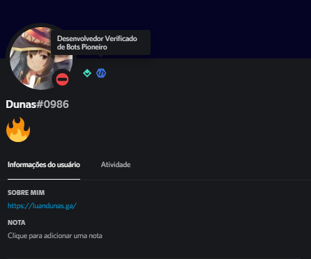

# Olá, eu sou o [Luan](https://luandunas.ga/)! 

	<ul>
		<li>🔍 Estou buscando a primeira oportunidade na área como Desenvolvedor Front-end | Web Júnior.</li>
		<li>📚 Estou cursando uma capacitação Full Stack na <a href="https://newtab.academy/" target="_blank">New Tab Academy.</a></li>
		<li>📭 Você pode me encontrar em: <a href="https://twitter.com/luandunas">@luandunas.</a></li>
		<li>🕹️ Curiosidades: Sou amante de jogos online e de beatbox.</li>
	</ul>

##

	<h1>🏆 Conquistas</h1>
	<ul>
		<li> Badge concedida pelo <a href="https://discord.com/">Discord</a> por criar um Chatbot que está presente em mais de <strong>500</strong> grupos e contando! </li>
	</ul>

##

<dl>
	<h1>💡 Projetos</h1>
	<dt><h2>Globout: Chatbot para o Discord</h2></dt>
	<dd>Globout é um Chatbot desenvolvido usando API do Discord e da Steam. Ele foi criado para consultar estatísticas de jogadores no <a href="https://store.steampowered.com/app/730/CounterStrike_Global_Offensive/">Counter-Strike: Global Offensive</a>  
Linguagens e Ferramentas utilizadas:    
</dd>
	<dt><h2><a href="https://sanud.bot.nu">Rádio Lo-fi 24/7</a></h2></dt>
	<dd>Sanud é mais um dos meus Chatbots, mas dessa vez resolvi ampliar para aprender mais linguagens e frameworks. Busquei criar um ambiente confortável para quem visita o website. Para agregar ao lofi, criei uma interface baseada no Windows 98 com backgrounds animados e simples. 
Linguagens e Ferramentas utilizadas:    
</dd>
</dl>